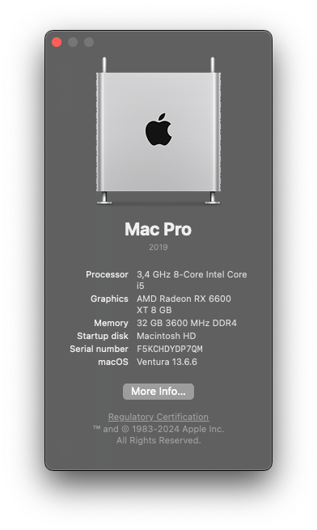
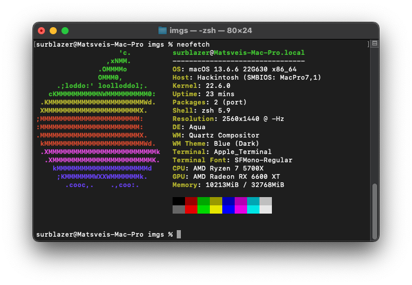

# OpenCore EFI Setup for Asus TUF B550-Plus, Ryzen 5700X and Radeon RX 6600 XT

OpenCore's EFI folder foder AMD based Hackintosh.

## System Specifications

| Name               | Model                            |
| ------------------ | -------------------------------- |
| **Motherboard**    | Asus TUF B550-Plus               |
| **CPU**            | AMD Ryzen 5700X                  |
| **GPU**            | Gigabyte Radeon RX 6600 XT 8GB   |
| **RAM**            | HyperX Fury 2x16 DDR4 3600 MHz   |
| **SSD**            | Lexar NM710 2TB                  |
| **Ethernet**       | Realtek Ethernet Controller      |
| **WiFi/Bluetooth** | Fenvi T919 (BCM94360)            |

### Software

- **OpenCore:** v0.9.5
- **macOS:** v13.6.4 Ventura - v14.1 Sonoma

## Known Issues

- Front jack not working
